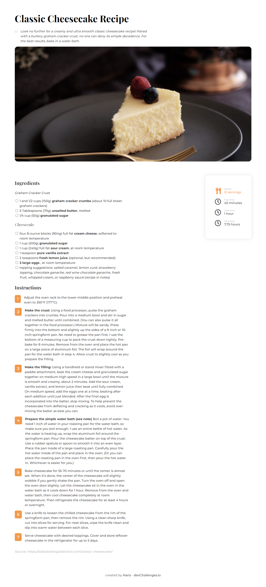
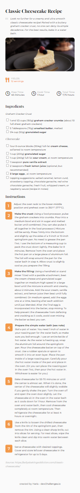

<!-- Please update value in the {}  -->

<h1 align="center">Classic Cheesecake Recipe app</h1>

   Solution for a challenge from  <a href="http://devchallenges.io" target="_blank">Devchallenges.io</a>.

  <h3>
    <a href="https://dev-recipe.netlify.app/">
      Demo
    </a>
     | 
    <a href="https://github.com/hariscs/dev-recipe-blog">
      Solution
    </a>
     | 
    <a href="https://devchallenges.io/challenges/OEKdUZ6xs0h99C38XVht">
      Challenge
    </a>
  </h3>

<!-- TABLE OF CONTENTS -->

## Table of Contents

- [Overview](#overview)
- [Built With](#built-with)
- [Features](#features)
- [Contact](#contact)

<!-- OVERVIEW -->

## Overview

### Built With

- HTML
- CSS
- CSS flexbox

## Features

<!-- List the features of your application or follow the template. Don't share the figma file here :) -->

This application/site was created as a submission to a [DevChallenges](https://devchallenges.io/challenges) challenge. The [challenge](https://devchallenges.io/challenges/TtUjDt19eIHxNQ4n5jps) was to build an application to complete the following user stories:

- [x] User story: This is a completed user stories
- [ ] User story: This is a incompleted user stories
- [ ] User story: This is a incompleted 2nd user stories

## Contact

- Website [Haris](https://harisshah.codes/)
- GitHub [@hariscs](https://github.com/hariscs)
- Twitter [@\_haris_shah](https://twitter.com/_haris_shah)
